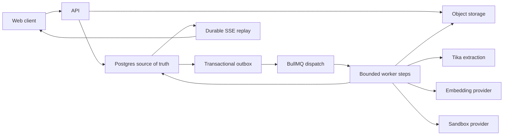

# Durable context and long-running task operations

This runbook covers the web platform’s personal memory, project knowledge,
prompt caching, structured compaction, and durable task runner. It describes
the initial rollout and rollback path; it does not contain credentials.

## Source-of-truth boundaries

Postgres is authoritative for tenant identity, memory, project-file links,
knowledge metadata and chunks, session entries, checkpoints, task runs, steps,
events, approvals, questions, maintenance progress, usage, and cache telemetry.
Every new tenant-owned table uses row-level security and is accessed with
`berry_set_tenant_id`.

S3-compatible object storage is authoritative for uploaded file bytes, text
derivatives, and sandbox snapshot archives. `knowledge_sources`,
`file_derivatives`, and `sandbox_snapshots` contain durable references and
hashes, not a second copy of the bytes.

Redis/BullMQ dispatches work. `runtime_outbox`, `turn_runs`, and `turn_steps`
remain authoritative if Redis is flushed or a worker dies. RxJS and SSE provide
low-latency delivery; `turn_events` provides ordered replay. The provider’s
prompt cache is an optimization. Cache loss cannot change memory, retrieval, or
conversation correctness.

SQLite at `BERRY_RUNTIME_DB_PATH` is the rollback adapter for new inline turns
when `BERRY_DURABLE_RUNNER_ENABLED=false`. It is not authoritative for the
normal self-hosted web path.



## pgvector migration and rollback

Compose pins `pgvector/pgvector:0.8.2-pg16-bookworm`. Kubernetes must point its
external Postgres at a PostgreSQL 16-compatible server where the `vector`
extension can be created by the migration role.

Before the rollout:

1. Take and verify a Postgres backup.
2. Confirm the target server exposes the extension:

   ```sql
   SELECT name, default_version, installed_version
   FROM pg_available_extensions
   WHERE name = 'vector';
   ```

3. Start the pinned pgvector-capable database image before API migrations.
4. Start one API instance and allow additive migrations 27–33 to finish.
5. Confirm `schema_migrations` through migration 33, `pg_extension`, and the
   `knowledge_chunks_search_idx` index before adding workers.

Do not downgrade a migrated database to a stock Postgres image that lacks the
extension. For an application rollback, roll back the API/web/worker image but
keep the pgvector database image and additive schema. For a database rollback,
stop all writers and restore the verified pre-migration backup. Do not drop the
extension or vector column in place.

## Tika and embeddings

`BERRY_TIKA_URL` points workers at the private Tika service. Compose and Helm
pin `apache/tika:3.2.3.0-full`. Do not expose Tika publicly. Extraction failures
leave a source in `failed`; the Project Knowledge surface can enqueue a retry.

Compose runs a private CPU embedding service using
`sentence-transformers/all-mpnet-base-v2`. Its vector contract is:

- `BERRY_EMBEDDING_PROVIDER=openai-compatible`
- `BERRY_EMBEDDING_BASE_URL=http://embeddings:80/v1`
- `BERRY_EMBEDDING_MODEL=sentence-transformers/all-mpnet-base-v2`
- `BERRY_EMBEDDING_DIMENSIONS=768`
- `BERRY_EMBEDDING_PROFILE_VERSION=2`
- `BERRY_KNOWLEDGE_CHUNK_TOKENS=300`
- `BERRY_KNOWLEDGE_CHUNK_OVERLAP_TOKENS=50`

Changing dimensions requires a new additive schema/profile migration and a
reindex. Changing the model with the same dimensions requires incrementing
`BERRY_EMBEDDING_PROFILE_VERSION`, then reindexing. If embeddings are
temporarily unavailable, full-text retrieval remains active and sources record
the degraded vector state.

## Backfill and reindex

Build the worker before using its operator CLI:

```sh
pnpm --filter @berry/worker build
```

Create workspace-file links and knowledge work for existing project data:

```sh
pnpm --filter @berry/worker maintenance -- backfill \
  --tenant 00000000-0000-7000-8000-000000000001 \
  --batch 100
```

The command prints a run UUID. Existing task-linked files are conservatively
backfilled as `task_only`; an authorized user can explicitly promote a file to
project-wide knowledge. The job then creates missing active file sources and
enqueues completed task outcomes. It never mines historical chats into
personal memory.

Inspect progress or cancel future batches:

```sh
pnpm --filter @berry/worker maintenance -- status \
  --tenant 00000000-0000-7000-8000-000000000001 \
  --run RUN_UUID

pnpm --filter @berry/worker maintenance -- cancel \
  --tenant 00000000-0000-7000-8000-000000000001 \
  --run RUN_UUID
```

`maintenance_runs` exposes the current phase, durable cursor, scanned rows,
changed rows, downstream jobs enqueued, failure count, and last error. Every
batch is tenant-scoped, bounded to 10–500 rows, checkpointed with its mutation,
and resumed through the transactional outbox. Re-running a completed backfill
is safe: unique keys and deterministic downstream dedupe keys prevent duplicate
links and revisions.

For one failed file, use Retry in Project Knowledge. For a broad reindex,
enqueue `knowledge.reindex` for active source revisions in bounded tenant
batches; that job resets the source and continues through the normal
extract/chunk/embed pipeline.

## Prompt-cache telemetry

Settings → My usage → Prompt cache diagnostics shows request-level eligibility,
read tokens, write tokens, and miss reason. Aggregate `cache_read_tokens` and
`cache_write_tokens` are also stored in `usage_rollups`.

Cache controls are sent only when the selected entry in
`BERRY_ROUTER_MODELS_JSON` explicitly declares
`capabilities.promptCaching`. API and worker must receive the same model JSON,
provider ID, route, and default model. The durable worker hashes its ordered
stable system/tool prefix into `turn_runs.prompt_manifest`; checkpoint,
retrieval, memory, request text, and identifiers remain outside that hash.

- A hit has `cache_eligible=true` and `cache_read_tokens > 0`.
- `first_request` is expected for the first stable prefix.
- `below_minimum_tokens` means the provider’s cache threshold was not reached.
- `prefix_changed` usually means a supposedly stable system/tool prefix moved
  or changed. Dynamic memory and retrieval belong after that prefix.
- `routing_changed` means provider/model routing changed between requests.
- `cache_expired` means the provider retention window elapsed.
- `provider_unsupported` or `retention_unsupported` means capability gating
  correctly avoided unsupported controls.
- `unknown` with repeated eligible misses should be investigated against the
  provider response and prompt-manifest hash.

Never treat a cache miss as lost memory. The next request still assembles
authorized memory and project retrieval from Postgres.

## Compaction during long runs

Before each durable model step, the worker follows the Pi harness policy: it
starts from the latest valid provider-reported context usage, adds trailing
journal entries conservatively, and compacts at the smaller of 85% of the
selected model context window or the window minus the 16,384-token compaction
reserve. As in Pi, it retains roughly the newest 20,000 tokens verbatim and
summarizes the older valid prefix. Checkpoint generation heartbeats both the
turn lease and its session-compaction lease.

After the checkpoint transaction commits, the next worker delivery reloads the
latest validated `SessionCheckpointV2` and sends only entries after its covered
leaf. Invalid model output is repaired once and then replaced by the
deterministic fallback; a failed summary never discards the prior rolling
checkpoint or journal.

Durable turns do not have model-iteration, tool-call, cumulative-token,
per-turn spend, or wall-clock ceilings. They continue until the model finishes,
the user cancels, a tool explicitly suspends or terminates the run, an actual
error occurs, or an organization/department/user hard allowance is exhausted.
Before each model request, the worker extends the existing budget reservation
for the projected call under the applicable scope locks; this makes the normal
account allowance, rather than a hidden turn budget, the spend boundary.

## Turn leases and recovery

One queue delivery advances one bounded state or small batch. A worker claims a
Postgres lease, heartbeats around provider/tool/snapshot work, persists intent
before side effects, and persists outcome before advancing the session leaf.
An expired lease is reclaimed from the stored next action.

Read-only and idempotent work may resume automatically. A shell command or
external write classified `non_idempotent_manual` is never replayed solely
because a lease expired. Berry marks the run `recovery_required`; an authorized
operator can retry, mark the tool complete, or cancel. Review the stored tool
arguments, result/error, timestamps, and the external system before choosing.

Approvals and user questions release the lease. Their durable rows and replayed
events restore the pending UI after reload. Redis loss delays work but does not
erase it; the outbox dispatcher and expired-lease scan wake it again.

## Sandbox restore

The run stores provider, sandbox ID, state, and heartbeat. A worker first tries
to reconnect to that sandbox. At configured intervals and before important wait
or finalization boundaries, it archives `/workspace`, skips unchanged hashes,
and records the current session leaf.

If reconnect fails, the worker creates a replacement sandbox and restores the
newest complete archive. Archives exclude secrets, unsafe paths, dependency
stores, and transient caches; individual files and total archives are bounded.
Check `sandbox_snapshots.status`, `failure_reason`, `object_key`, and
`content_hash` when restore fails. Object-store lifecycle rules must not delete
archives earlier than the database retention policy.

## Personal memory export and deletion

Settings → Memory exports the authenticated user’s memory as JSON. Forget and
clear-all create append-only `FORGET` versions and remove entries from active
recall; they do not trust a tenant or user ID supplied by the browser. Expired
entries are forgotten by the cleanup job through the same version trail.

Memory is keyed by immutable `(tenant_id, user_id)`. Workspace memory adds
`workspace_id`. Do not repair or copy memory with email addresses. The initial
backfill deliberately creates no inferred personal memory.

## Retention cleanup

The initial policy retains:

- finalized durable SSE events for 30 days;
- retrieval diagnostics and tombstoned knowledge sources for 30 days;
- completed outbox rows for 7 days;
- active memory until forgotten, superseded, or expired;
- session entries/checkpoints and the settled message transcript until their
  parent task/session is deleted under the organization’s data policy;
- sandbox archives under the object-store lifecycle policy.

Run cleanup per tenant:

```sh
pnpm --filter @berry/worker maintenance -- cleanup \
  --tenant 00000000-0000-7000-8000-000000000001 \
  --batch 100 \
  --event-days 30 \
  --diagnostic-days 30 \
  --outbox-days 7
```

Cleanup is bounded, resumable, and visible in `maintenance_runs`. It forgets
expired memory with an audit version, deletes old events only for terminal
runs, removes old retrieval diagnostics and knowledge tombstones, then removes
completed outbox records. Run it from the normal scheduler or an operator
job—never as an unbounded API request.

## Feature-flag rollback order

Flags are read when API/worker processes start. Change configuration in the
untracked secret environment and restart only affected services.

1. Set `BERRY_DURABLE_RUNNER_ENABLED=false` to route new turns to the inline
   rollback adapter. Keep workers running until already-admitted durable runs
   reach a terminal or explicit recovery state.
2. Set `BERRY_PROMPT_CACHE_ENABLED=false` if provider cache controls or
   telemetry cause trouble. This does not affect context correctness.
3. Set `BERRY_IMPLICIT_MEMORY_ENABLED=false` to stop new inferred facts while
   retaining explicit memory and recall.
4. Set `BERRY_PROJECT_KNOWLEDGE_ENABLED=false` to stop project ingestion and
   retrieval. Existing source rows and object bytes remain intact.
5. Set `BERRY_MEMORY_ENABLED=false` only when all personal/project recall must
   be disabled. Existing versioned data remains exportable and forgettable.

Re-enable in the reverse order after the relevant queue failures and migration
state are understood. Do not rewrite or remove applied migrations as a feature
rollback.
