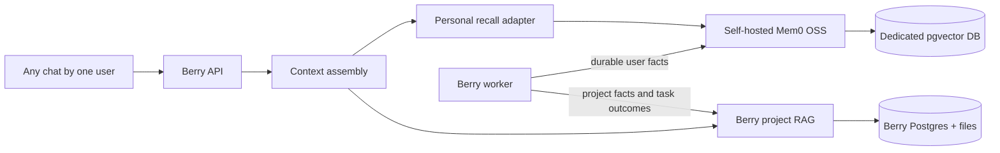

# Self-hosted personal memory

Berry uses the open-source `mem0ai/oss` package for personal memory. It does not
call Mem0's hosted service. The package runs inside Berry as the private
`@berry/mem0` service and stores vectors in a dedicated pgvector database.

## Ownership boundaries

| Context | Owner | Storage |
| --- | --- | --- |
| A user's durable preferences and profile across chats | Mem0 OSS | Dedicated Mem0 pgvector database |
| Project files, facts, task outcomes, and shared project context | Berry memory engine | Berry Postgres, object storage, and pgvector |
| Compacted conversation state and long-running run checkpoints | Berry runtime | Berry Postgres and sandbox snapshots |
| Provider prompt-cache measurements | Berry runtime/provider adapters | Berry usage and diagnostic records |



Tenant and user IDs are combined into a Mem0 `user_id` namespace:
`berry:<tenant-id>:<user-id>`. The service also checks both IDs in metadata
before ID-based reads, updates, or deletes. This prevents one tenant or user
from addressing another user's memory even if a memory UUID is disclosed.

## Docker Compose

1. Copy the example environment file and replace every placeholder:

   ```sh
   cp deploy/.env.example deploy/.env
   openssl rand -hex 32
   ```

2. Put the generated value in `BERRY_MEM0_API_KEY`, set a strong
   `BERRY_MEM0_POSTGRES_PASSWORD`, and configure the Mem0 LLM and embedding
   endpoints. Both endpoints must be OpenAI-compatible.

3. Build and start Berry normally:

   ```sh
   docker compose --env-file deploy/.env -f deploy/compose.yaml up -d --build
   ```

Compose starts `mem0-postgres`, `mem0`, the API, and the worker. Mem0 is
reachable only on loopback from the host and on the private Compose network
from Berry. The API does not depend on Mem0 for startup: project work remains
available while personal-memory reads report a degraded state and personal
mutations return `503`.

The default provider is:

```text
BERRY_PERSONAL_MEMORY_PROVIDER=mem0
BERRY_MEM0_BASE_URL=http://mem0:8010
MEM0_TELEMETRY=false
```

Set `BERRY_PERSONAL_MEMORY_PROVIDER=berry` as a rollback seam. In `auto` mode,
Berry selects Mem0 only when both its base URL and internal API key are present.
There is no automatic write fallback during an outage because silently
splitting new personal memories across two stores is harder to recover from
than retrying the durable worker job.

## Kubernetes and Helm

The chart creates the internal Mem0 Deployment and Service when
`mem0.enabled=true`. Create the named secret before installation:

```sh
kubectl create secret generic berry-mem0 \
  --from-literal=BERRY_MEM0_API_KEY="<internal-service-secret>" \
  --from-literal=BERRY_MEM0_DATABASE_URL="<private-pgvector-url>"
```

The default chart expects an existing PostgreSQL database with pgvector. The
LLM and embedding requests use the chart's private Berry Router endpoint and
key. Model IDs and embedding dimensions are independently configurable under
`mem0` in `values.yaml`.

## Reliability behavior

- API writes and recall use a typed HTTP adapter with bounded timeouts.
- Mem0's pgvector adapter is wrapped with a bounded `pg.Pool`; concurrent
  searches do not share one executing `pg.Client`, and idle socket errors are
  handled without terminating the Mem0 process.
- Read-only requests retry once for transient network, rate-limit, and 5xx
  failures. Mutations are not blindly retried.
- Background extraction carries the durable outbox identity into Mem0.
  Replayed jobs return `NOOP` instead of inserting the same extracted facts
  again.
- Mem0 owns only personal extraction. Berry's extraction prompt is restricted
  to project candidates while Mem0 is enabled.
- Project RAG and legacy Berry personal records remain readable during recall
  and export. Clear/forget operations also cover legacy personal records.
- The service refuses to become healthy until its pgvector database is
  reachable. Personal-memory management and mutation requests return a
  sanitized `503` if it is unavailable, while chat recall continues with Berry
  project context and marks personal recall as degraded. Worker failures remain
  retryable.
- Secrets and credential-looking source lines are removed before implicit
  extraction. Retrieved memory remains untrusted grounding, never executable
  instructions.

Before a production rollout, run the real adapter recovery test against a
disposable pgvector database. It issues 50 simultaneous searches, terminates
one active Mem0 PostgreSQL backend, and verifies that later searches recover:

```sh
BERRY_MEM0_TEST_DATABASE_URL=postgres://... \
  pnpm --filter @berry/mem0 exec vitest run src/pgvector-pool.integration.test.ts
```

The database role used by this test must be allowed to create the `vector`
extension and call `pg_terminate_backend` for its own sessions. The test uses a
unique collection and removes it afterward. Never point it at production.

## Data and backups

Compose stores Mem0 data in the `mem0_postgres_data` volume.
`deploy/backup.sh` dumps it as `mem0-postgres.dump` and includes it in the
checksum manifest; `deploy/restore.sh` restores it while Mem0 and its callers
are stopped. Restores must preserve the configured embedding model and
dimension; changing dimensions requires a new collection and re-embedding.

Self-hosting Mem0 keeps the memory service and vector data inside the Berry
deployment. The configured LLM and embedding providers still receive the
content needed for extraction and embedding. Point those settings at an
on-premises OpenAI-compatible endpoint when prompts must not leave the network.
